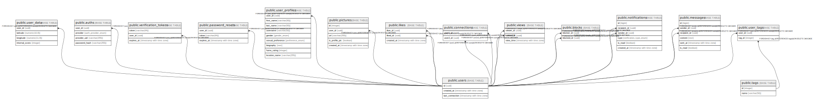

# matcha

## Tables

| Name | Columns | Comment | Type |
| ---- | ------- | ------- | ---- |
| [public.users](public.users.md) | 3 |  | BASE TABLE |
| [public.user_data](public.user_data.md) | 4 |  | BASE TABLE |
| [public.auths](public.auths.md) | 7 |  | BASE TABLE |
| [public.verification_tokens](public.verification_tokens.md) | 3 |  | BASE TABLE |
| [public.password_resets](public.password_resets.md) | 3 |  | BASE TABLE |
| [public.user_profiles](public.user_profiles.md) | 11 |  | BASE TABLE |
| [public.tags](public.tags.md) | 2 |  | BASE TABLE |
| [public.user_tags](public.user_tags.md) | 2 |  | BASE TABLE |
| [public.pictures](public.pictures.md) | 5 |  | BASE TABLE |
| [public.likes](public.likes.md) | 3 |  | BASE TABLE |
| [public.connections](public.connections.md) | 2 |  | BASE TABLE |
| [public.views](public.views.md) | 3 |  | BASE TABLE |
| [public.blocks](public.blocks.md) | 2 |  | BASE TABLE |
| [public.notifications](public.notifications.md) | 6 |  | BASE TABLE |
| [public.messages](public.messages.md) | 6 |  | BASE TABLE |
| [public.refresh_tokens](public.refresh_tokens.md) | 5 |  | BASE TABLE |

## Stored procedures and functions

| Name | ReturnType | Arguments | Type |
| ---- | ------- | ------- | ---- |
| public.uuid_nil | uuid |  | FUNCTION |
| public.uuid_ns_dns | uuid |  | FUNCTION |
| public.uuid_ns_url | uuid |  | FUNCTION |
| public.uuid_ns_oid | uuid |  | FUNCTION |
| public.uuid_ns_x500 | uuid |  | FUNCTION |
| public.uuid_generate_v1 | uuid |  | FUNCTION |
| public.uuid_generate_v1mc | uuid |  | FUNCTION |
| public.uuid_generate_v3 | uuid | namespace uuid, name text | FUNCTION |
| public.uuid_generate_v4 | uuid |  | FUNCTION |
| public.uuid_generate_v5 | uuid | namespace uuid, name text | FUNCTION |

## Enums

| Name | Values |
| ---- | ------- |
| public.auth_provider_enum | apple, facebook, github, google, local |
| public.gender_enum | female, male, other |
| public.notification_type_enum | like, match, message, unlike, view |
| public.preference_enum | bisexual, heterosexual, homosexual |

## Relations

---

> Generated by [tbls](https://github.com/k1LoW/tbls)
