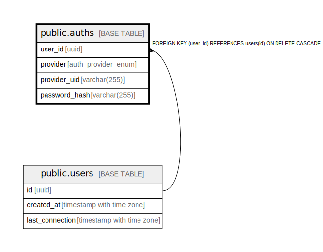

# public.auths

## Description

## Columns

| Name | Type | Default | Nullable | Children | Parents | Comment |
| ---- | ---- | ------- | -------- | -------- | ------- | ------- |
| id | integer | nextval('auths_id_seq'::regclass) | false |  |  |  |
| user_id | uuid |  | false |  | [public.users](public.users.md) |  |
| provider | auth_provider_enum |  | false |  |  |  |
| provider_uid | varchar(255) |  | true |  |  |  |
| email | varchar(255) |  | true |  |  |  |
| is_verified | boolean | false | false |  |  |  |
| password_hash | varchar(255) |  | true |  |  |  |

## Constraints

| Name | Type | Definition |
| ---- | ---- | ---------- |
| auths_user_id_fkey | FOREIGN KEY | FOREIGN KEY (user_id) REFERENCES users(id) ON DELETE CASCADE |
| auths_pkey | PRIMARY KEY | PRIMARY KEY (id) |
| auths_user_id_provider_key | UNIQUE | UNIQUE (user_id, provider) |
| auths_provider_provider_uid_key | UNIQUE | UNIQUE (provider, provider_uid) |
| auths_provider_email_key | UNIQUE | UNIQUE (provider, email) |

## Indexes

| Name | Definition |
| ---- | ---------- |
| auths_pkey | CREATE UNIQUE INDEX auths_pkey ON public.auths USING btree (id) |
| auths_user_id_provider_key | CREATE UNIQUE INDEX auths_user_id_provider_key ON public.auths USING btree (user_id, provider) |
| auths_provider_provider_uid_key | CREATE UNIQUE INDEX auths_provider_provider_uid_key ON public.auths USING btree (provider, provider_uid) |
| auths_provider_email_key | CREATE UNIQUE INDEX auths_provider_email_key ON public.auths USING btree (provider, email) |

## Relations

---

> Generated by [tbls](https://github.com/k1LoW/tbls)
