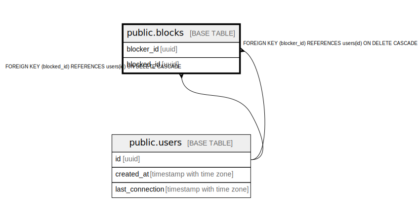

# public.blocks

## Description

## Columns

| Name | Type | Default | Nullable | Children | Parents | Comment |
| ---- | ---- | ------- | -------- | -------- | ------- | ------- |
| blocker_id | uuid |  | false |  | [public.users](public.users.md) |  |
| blocked_id | uuid |  | false |  | [public.users](public.users.md) |  |

## Constraints

| Name | Type | Definition |
| ---- | ---- | ---------- |
| blocks_check | CHECK | CHECK ((blocker_id <> blocked_id)) |
| blocks_blocked_id_fkey | FOREIGN KEY | FOREIGN KEY (blocked_id) REFERENCES users(id) ON DELETE CASCADE |
| blocks_blocker_id_fkey | FOREIGN KEY | FOREIGN KEY (blocker_id) REFERENCES users(id) ON DELETE CASCADE |
| blocks_pkey | PRIMARY KEY | PRIMARY KEY (blocker_id, blocked_id) |

## Indexes

| Name | Definition |
| ---- | ---------- |
| blocks_pkey | CREATE UNIQUE INDEX blocks_pkey ON public.blocks USING btree (blocker_id, blocked_id) |

## Relations

---

> Generated by [tbls](https://github.com/k1LoW/tbls)
