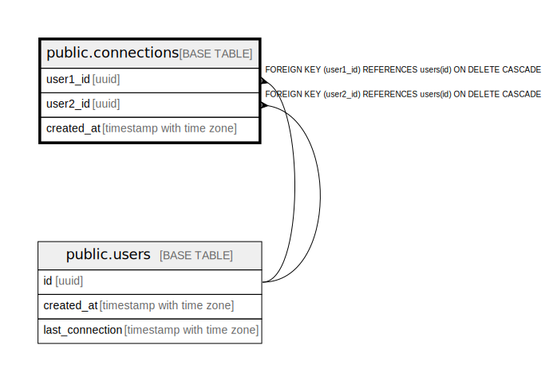

# public.connections

## Description

## Columns

| Name | Type | Default | Nullable | Children | Parents | Comment |
| ---- | ---- | ------- | -------- | -------- | ------- | ------- |
| user1_id | uuid |  | false |  | [public.users](public.users.md) |  |
| user2_id | uuid |  | false |  | [public.users](public.users.md) |  |

## Constraints

| Name | Type | Definition |
| ---- | ---- | ---------- |
| connections_check | CHECK | CHECK ((user1_id < user2_id)) |
| connections_user1_id_fkey | FOREIGN KEY | FOREIGN KEY (user1_id) REFERENCES users(id) ON DELETE CASCADE |
| connections_user2_id_fkey | FOREIGN KEY | FOREIGN KEY (user2_id) REFERENCES users(id) ON DELETE CASCADE |
| connections_pkey | PRIMARY KEY | PRIMARY KEY (user1_id, user2_id) |

## Indexes

| Name | Definition |
| ---- | ---------- |
| connections_pkey | CREATE UNIQUE INDEX connections_pkey ON public.connections USING btree (user1_id, user2_id) |

## Relations

---

> Generated by [tbls](https://github.com/k1LoW/tbls)
