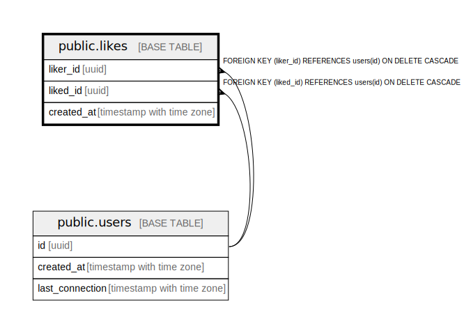

# public.likes

## Description

## Columns

| Name | Type | Default | Nullable | Children | Parents | Comment |
| ---- | ---- | ------- | -------- | -------- | ------- | ------- |
| liker_id | uuid |  | false |  | [public.users](public.users.md) |  |
| liked_id | uuid |  | false |  | [public.users](public.users.md) |  |
| created_at | timestamp with time zone | CURRENT_TIMESTAMP | true |  |  |  |

## Constraints

| Name | Type | Definition |
| ---- | ---- | ---------- |
| likes_check | CHECK | CHECK ((liker_id <> liked_id)) |
| likes_liked_id_fkey | FOREIGN KEY | FOREIGN KEY (liked_id) REFERENCES users(id) ON DELETE CASCADE |
| likes_liker_id_fkey | FOREIGN KEY | FOREIGN KEY (liker_id) REFERENCES users(id) ON DELETE CASCADE |
| likes_pkey | PRIMARY KEY | PRIMARY KEY (liker_id, liked_id) |

## Indexes

| Name | Definition |
| ---- | ---------- |
| likes_pkey | CREATE UNIQUE INDEX likes_pkey ON public.likes USING btree (liker_id, liked_id) |

## Relations

---

> Generated by [tbls](https://github.com/k1LoW/tbls)
