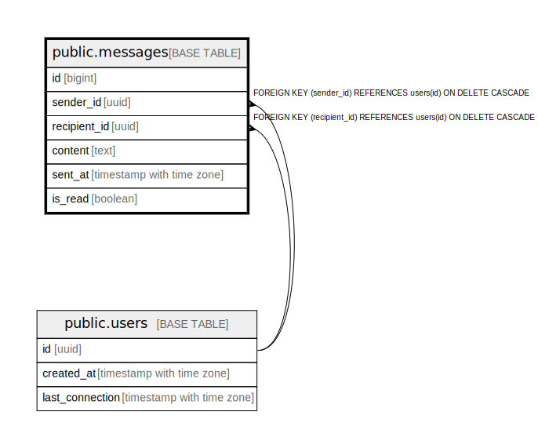

# public.messages

## Description

## Columns

| Name | Type | Default | Nullable | Children | Parents | Comment |
| ---- | ---- | ------- | -------- | -------- | ------- | ------- |
| id | bigint | nextval('messages_id_seq'::regclass) | false |  |  |  |
| sender_id | uuid |  | true |  | [public.users](public.users.md) |  |
| recipient_id | uuid |  | true |  | [public.users](public.users.md) |  |
| content | text |  | false |  |  |  |
| sent_at | timestamp with time zone | CURRENT_TIMESTAMP | true |  |  |  |
| is_read | boolean | false | true |  |  |  |

## Constraints

| Name | Type | Definition |
| ---- | ---- | ---------- |
| messages_recipient_id_fkey | FOREIGN KEY | FOREIGN KEY (recipient_id) REFERENCES users(id) ON DELETE CASCADE |
| messages_sender_id_fkey | FOREIGN KEY | FOREIGN KEY (sender_id) REFERENCES users(id) ON DELETE CASCADE |
| messages_pkey | PRIMARY KEY | PRIMARY KEY (id) |

## Indexes

| Name | Definition |
| ---- | ---------- |
| messages_pkey | CREATE UNIQUE INDEX messages_pkey ON public.messages USING btree (id) |
| idx_messages_chat_history | CREATE INDEX idx_messages_chat_history ON public.messages USING btree (sender_id, recipient_id, sent_at) |

## Relations

---

> Generated by [tbls](https://github.com/k1LoW/tbls)
