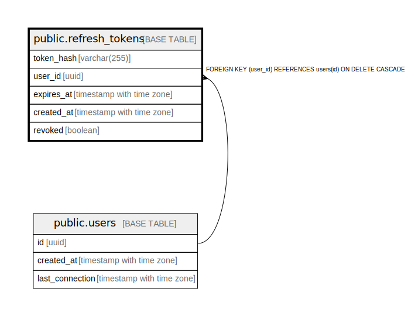

# public.refresh_tokens

## Description

## Columns

| Name | Type | Default | Nullable | Children | Parents | Comment |
| ---- | ---- | ------- | -------- | -------- | ------- | ------- |
| token_hash | varchar(255) |  | false |  |  |  |
| user_id | uuid |  | false |  | [public.users](public.users.md) |  |
| expires_at | timestamp with time zone |  | false |  |  |  |
| created_at | timestamp with time zone | now() | false |  |  |  |
| revoked | boolean | false | false |  |  |  |

## Constraints

| Name | Type | Definition |
| ---- | ---- | ---------- |
| refresh_tokens_user_id_fkey | FOREIGN KEY | FOREIGN KEY (user_id) REFERENCES users(id) ON DELETE CASCADE |
| refresh_tokens_pkey | PRIMARY KEY | PRIMARY KEY (token_hash) |

## Indexes

| Name | Definition |
| ---- | ---------- |
| refresh_tokens_pkey | CREATE UNIQUE INDEX refresh_tokens_pkey ON public.refresh_tokens USING btree (token_hash) |

## Relations

---

> Generated by [tbls](https://github.com/k1LoW/tbls)
