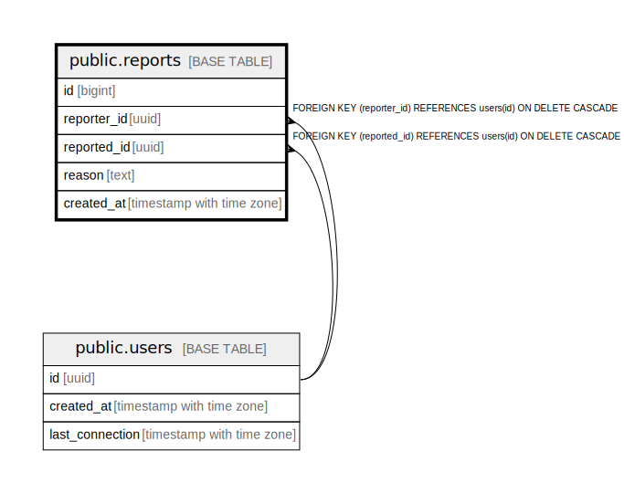

# public.reports

## Description

## Columns

| Name | Type | Default | Nullable | Children | Parents | Comment |
| ---- | ---- | ------- | -------- | -------- | ------- | ------- |
| id | bigint | nextval('reports_id_seq'::regclass) | false |  |  |  |
| reporter_id | uuid |  | true |  | [public.users](public.users.md) |  |
| reported_id | uuid |  | true |  | [public.users](public.users.md) |  |
| reason | text |  | true |  |  |  |
| created_at | timestamp with time zone | CURRENT_TIMESTAMP | true |  |  |  |

## Constraints

| Name | Type | Definition |
| ---- | ---- | ---------- |
| reports_check | CHECK | CHECK ((reporter_id <> reported_id)) |
| reports_reported_id_fkey | FOREIGN KEY | FOREIGN KEY (reported_id) REFERENCES users(id) ON DELETE CASCADE |
| reports_reporter_id_fkey | FOREIGN KEY | FOREIGN KEY (reporter_id) REFERENCES users(id) ON DELETE CASCADE |
| reports_pkey | PRIMARY KEY | PRIMARY KEY (id) |

## Indexes

| Name | Definition |
| ---- | ---------- |
| reports_pkey | CREATE UNIQUE INDEX reports_pkey ON public.reports USING btree (id) |

## Relations

---

> Generated by [tbls](https://github.com/k1LoW/tbls)
