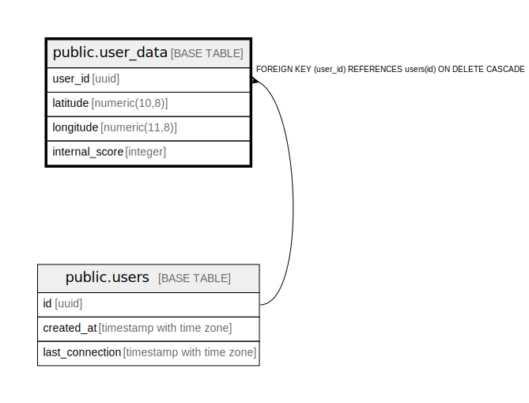

# public.user_data

## Description

## Columns

| Name | Type | Default | Nullable | Children | Parents | Comment |
| ---- | ---- | ------- | -------- | -------- | ------- | ------- |
| user_id | uuid |  | false |  | [public.users](public.users.md) |  |
| latitude | numeric(10,8) |  | false |  |  |  |
| longitude | numeric(11,8) |  | false |  |  |  |
| internal_score | integer | 0 | true |  |  |  |

## Constraints

| Name | Type | Definition |
| ---- | ---- | ---------- |
| user_data_user_id_fkey | FOREIGN KEY | FOREIGN KEY (user_id) REFERENCES users(id) ON DELETE CASCADE |
| user_data_pkey | PRIMARY KEY | PRIMARY KEY (user_id) |

## Indexes

| Name | Definition |
| ---- | ---------- |
| user_data_pkey | CREATE UNIQUE INDEX user_data_pkey ON public.user_data USING btree (user_id) |
| idx_user_data_location | CREATE INDEX idx_user_data_location ON public.user_data USING btree (latitude, longitude) |

## Relations

---

> Generated by [tbls](https://github.com/k1LoW/tbls)
