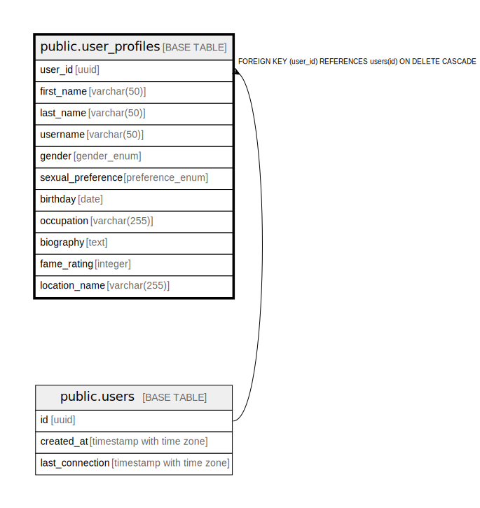

# public.user_profiles

## Description

## Columns

| Name | Type | Default | Nullable | Children | Parents | Comment |
| ---- | ---- | ------- | -------- | -------- | ------- | ------- |
| user_id | uuid |  | false |  | [public.users](public.users.md) |  |
| first_name | varchar(50) |  | false |  |  |  |
| last_name | varchar(50) |  | false |  |  |  |
| username | varchar(50) |  | true |  |  |  |
| gender | gender_enum |  | false |  |  |  |
| sexual_preference | preference_enum |  | false |  |  |  |
| birthday | date |  | false |  |  |  |
| occupation | varchar(255) |  | true |  |  |  |
| biography | text |  | true |  |  |  |
| fame_rating | integer |  | true |  |  |  |
| location_name | varchar(255) |  | true |  |  |  |

## Constraints

| Name | Type | Definition |
| ---- | ---- | ---------- |
| user_profiles_user_id_fkey | FOREIGN KEY | FOREIGN KEY (user_id) REFERENCES users(id) ON DELETE CASCADE |
| user_profiles_pkey | PRIMARY KEY | PRIMARY KEY (user_id) |

## Indexes

| Name | Definition |
| ---- | ---------- |
| user_profiles_pkey | CREATE UNIQUE INDEX user_profiles_pkey ON public.user_profiles USING btree (user_id) |

## Relations

---

> Generated by [tbls](https://github.com/k1LoW/tbls)
