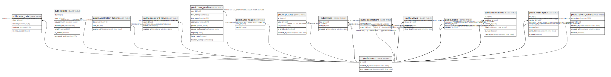

# public.users

## Description

## Columns

| Name | Type | Default | Nullable | Children | Parents | Comment |
| ---- | ---- | ------- | -------- | -------- | ------- | ------- |
| id | uuid | uuid_generate_v4() | false | [public.user_data](public.user_data.md) [public.auths](public.auths.md) [public.verification_tokens](public.verification_tokens.md) [public.password_resets](public.password_resets.md) [public.user_profiles](public.user_profiles.md) [public.user_tags](public.user_tags.md) [public.pictures](public.pictures.md) [public.likes](public.likes.md) [public.connections](public.connections.md) [public.views](public.views.md) [public.blocks](public.blocks.md) [public.notifications](public.notifications.md) [public.messages](public.messages.md) [public.refresh_tokens](public.refresh_tokens.md) |  |  |
| created_at | timestamp with time zone | CURRENT_TIMESTAMP | true |  |  |  |
| last_connection | timestamp with time zone |  | true |  |  |  |

## Constraints

| Name | Type | Definition |
| ---- | ---- | ---------- |
| users_pkey | PRIMARY KEY | PRIMARY KEY (id) |

## Indexes

| Name | Definition |
| ---- | ---------- |
| users_pkey | CREATE UNIQUE INDEX users_pkey ON public.users USING btree (id) |

## Relations

---

> Generated by [tbls](https://github.com/k1LoW/tbls)
