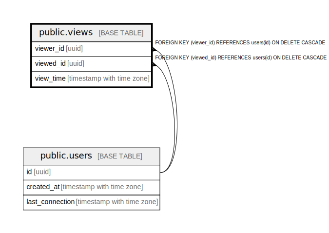

# public.views

## Description

## Columns

| Name | Type | Default | Nullable | Children | Parents | Comment |
| ---- | ---- | ------- | -------- | -------- | ------- | ------- |
| viewer_id | uuid |  | false |  | [public.users](public.users.md) |  |
| viewed_id | uuid |  | false |  | [public.users](public.users.md) |  |
| view_time | timestamp with time zone | CURRENT_TIMESTAMP | false |  |  |  |

## Constraints

| Name | Type | Definition |
| ---- | ---- | ---------- |
| views_viewed_id_fkey | FOREIGN KEY | FOREIGN KEY (viewed_id) REFERENCES users(id) ON DELETE CASCADE |
| views_viewer_id_fkey | FOREIGN KEY | FOREIGN KEY (viewer_id) REFERENCES users(id) ON DELETE CASCADE |
| views_pkey | PRIMARY KEY | PRIMARY KEY (viewer_id, viewed_id, view_time) |

## Indexes

| Name | Definition |
| ---- | ---------- |
| views_pkey | CREATE UNIQUE INDEX views_pkey ON public.views USING btree (viewer_id, viewed_id, view_time) |

## Relations

---

> Generated by [tbls](https://github.com/k1LoW/tbls)
