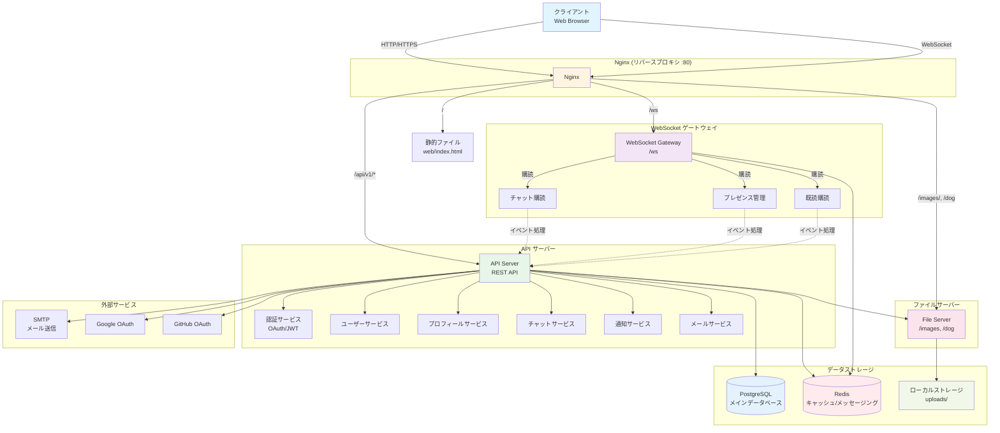

# Matcha プロジェクトアーキテクチャ

## 主要コンポーネント

### 1. Nginx (リバースプロキシ)
- ポート80でリクエストを受信
- ルーティング:
  - `/api/v1/*` → APIサーバー
  - `/ws` → WebSocketゲートウェイ
  - `/images/`, `/dog` → ファイルサーバー
  - `/` → 静的ファイル配信

### 2. APIサーバー
- REST API提供
- 主要機能:
  - 認証 (JWT, OAuth)
  - ユーザー管理
  - プロフィール管理
  - チャット機能
  - 通知機能
  - メール送信

### 3. WebSocketゲートウェイ
- WebSocket接続管理
- Redis経由でメッセージング
- プレゼンス管理
- チャット・既読イベント処理

### 4. ファイルサーバー
- 画像アップロード・配信
- ローカルストレージに保存

### 5. データストレージ
- **PostgreSQL**: メインデータベース
- **Redis**: キャッシュ・メッセージング・プレゼンス管理

### 6. 外部サービス
- **SMTP**: メール送信
- **Google OAuth**: Google認証
- **GitHub OAuth**: GitHub認証
