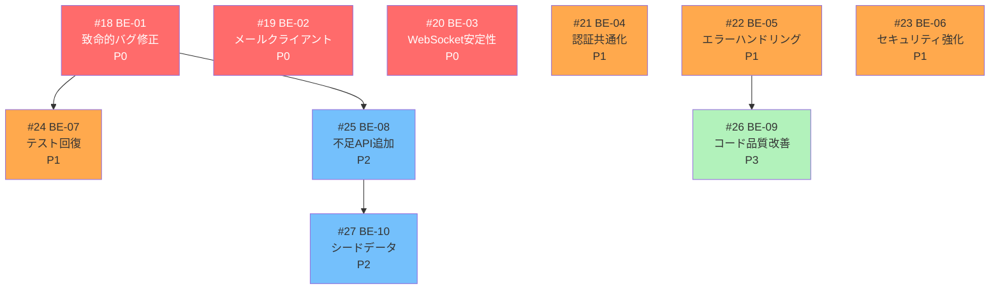
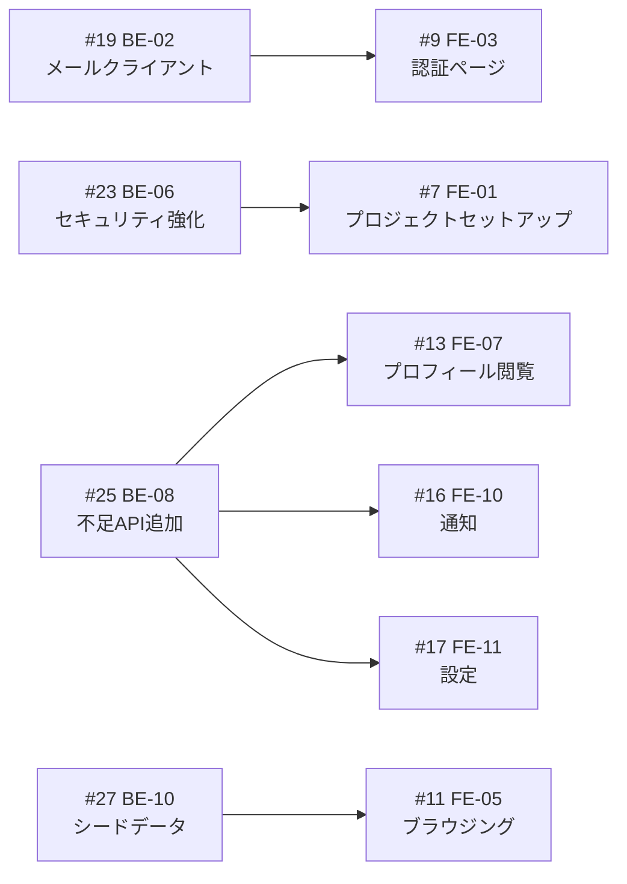

# Matcha バックエンド改善計画

## Issue一覧と依存関係

| Issue | タイトル | GitHub | 優先度 | 分類 |
|-------|---------|--------|--------|------|
| BE-01 | UoW・ハンドラの致命的バグ修正 | [#18](../../issues/18) | P0 | バグ |
| BE-02 | メールクライアントの本番対応 | [#19](../../issues/19) | P0 | バグ |
| BE-03 | WebSocket 安定性・並行性の改善 | [#20](../../issues/20) | P0/P2 | バグ |
| BE-04 | 認証ミドルウェア・ペイロード型の共通化 | [#21](../../issues/21) | P1 | リファクタ |
| BE-05 | エラーハンドリングの改善 | [#22](../../issues/22) | P1 | リファクタ |
| BE-06 | セキュリティ強化 | [#23](../../issues/23) | P1 | セキュリティ |
| BE-07 | テストカバレッジの回復・拡充 | [#24](../../issues/24) | P1 | テスト |
| BE-08 | 不足 API エンドポイントの追加 | [#25](../../issues/25) | P2 | 機能追加 |
| BE-09 | ドメインモデル・コード品質の改善 | [#26](../../issues/26) | P3 | リファクタ |
| BE-10 | 500件シードデータの生成 | [#27](../../issues/27) | P2 | データ |

## 依存関係グラフ

## フロントエンド Issue との依存関係

## フェーズ分け

### Phase 0: フロントエンド着手前（必須）
| Issue | 理由 |
|-------|------|
| [#18](../../issues/18) BE-01 | ハンドラが動かないとフロントが検証不能 |
| [#19](../../issues/19) BE-02 | メール認証フローが動かない |
| [#23](../../issues/23) BE-06 (CORS のみ) | CORS がないとフロントから API を叩けない |

### Phase 1: フロントエンドと並行
| Issue | 対応タイミング |
|-------|---------------|
| [#20](../../issues/20) BE-03 (P0部分) | WS 書き込み競合は FE-08 (WS基盤) 前に |
| [#21](../../issues/21) BE-04 | FE-08 着手前が理想 |
| [#22](../../issues/22) BE-05 | 随時 |
| [#24](../../issues/24) BE-07 | BE-01 修正後に |
| [#25](../../issues/25) BE-08 | FE-07, FE-10, FE-11 が必要とするタイミングで |

### Phase 2: フロントエンド中盤以降
| Issue | 対応タイミング |
|-------|---------------|
| [#20](../../issues/20) BE-03 (P2部分) | heartbeat, goroutine lifecycle |
| [#27](../../issues/27) BE-10 | FE-05 (ブラウジング) 前に |
| [#23](../../issues/23) BE-06 (残り) | 評価前に |

### Phase 3: 仕上げ
| Issue | 対応タイミング |
|-------|---------------|
| [#26](../../issues/26) BE-09 | 余裕があれば |

## レビュー指摘の詳細

### P0: 致命的バグ

| # | 内容 | ファイル | 影響 |
|---|------|---------|------|
| 1 | UoW がエラーを握りつぶす | `uow/uow.go:42` | トランザクション失敗が検知されない |
| 2 | メールが送信されない | `server/server.go:75` | 認証メール/リセットメールが届かない |
| 3 | Update handler が no-op | `handler/user_handler.go:225` | ユーザーデータ更新が保存されない |
| 4 | Upload handler が空 | `handler/profile_handler.go:163` | 写真アップロード不能 |
| 5 | WS 書き込み競合 | `wsgateway/.../handler.go:40` | 並行通知でクラッシュ |

### P1: セキュリティ

| # | 内容 | ファイル | リスク |
|---|------|---------|-------|
| 1 | CORS 未設定 | API 全体 | SPA から API コール不能 |
| 2 | ファイルサーバー認証なし | `filesrv/` | 任意ファイルアップロード |
| 3 | WS CheckOrigin 全許可 | `gateway.go:51` | WebSocket ハイジャック |
| 4 | DB プール未設定 | `main.go:86` | 接続枯渇 |

### P1: テスト

| # | 内容 | ファイル | 状態 |
|---|------|---------|------|
| 1 | user_handler_test.go | `handler/` | 167行コメントアウト |
| 2 | profile_handler_test.go | `handler/` | 170行コメントアウト |
| 3 | chat_test.go | `service/chat/` | 78行コメントアウト |
| 4 | main_test.go | `cmd/server/` | 110行コメントアウト |
| 5 | auth サービス | `service/auth/` | テスト0件 (380行超) |

### Go ベストプラクティス違反

| # | 内容 | 推奨 |
|---|------|------|
| 1 | エラーコンテキスト欠如 | `fmt.Errorf("operation: %w", err)` |
| 2 | `(nil, nil)` 返却 | `(nil, apperrors.ErrNotFound)` |
| 3 | `interface{}` in Pub/Sub | ジェネリクス `Publisher[T]` |
| 4 | 命名規則違反 | `SMTPHost`, `BaseURL`, `NewChatSubscriber` |
| 5 | Entity に `sql.Null*` | ポインタ型 + DTO 分離 |
| 6 | Handler に `db` タグ | `json` タグ |

## ステータス管理

GitHub Issue の状態で管理。このドキュメントは定期的に同期する。
