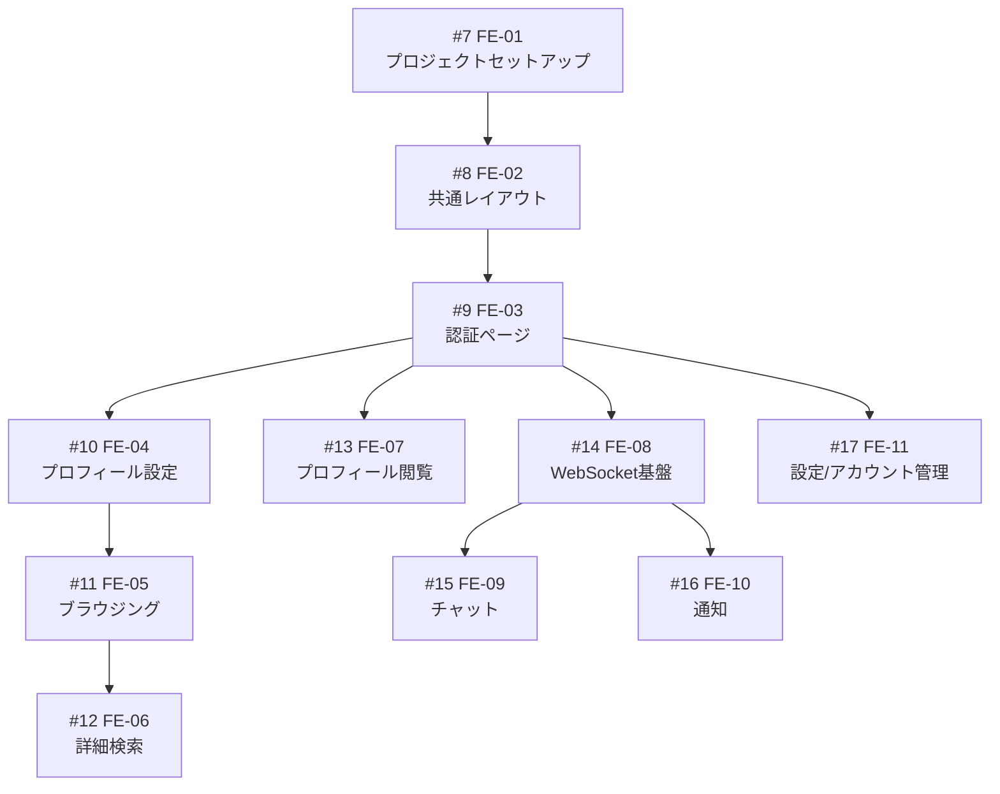

# Matcha フロントエンド実装計画

## 技術スタック

| 項目 | 選定 |
|------|------|
| フレームワーク | React 19 + Vite |
| 言語 | TypeScript |
| CSS | Tailwind CSS 4 |
| ルーティング | React Router v7 |
| 状態管理 | Zustand (軽量、ボイラープレート少) |
| HTTP通信 | fetch API + カスタムフック |
| WebSocket | ネイティブ WebSocket + Zustand store |
| フォーム | React Hook Form + Zod (バリデーション) |
| 通知トースト | Sonner |

## ディレクトリ構成（予定）

```
web/
├── index.html
├── vite.config.ts
├── tailwind.config.ts
├── tsconfig.json
├── package.json
├── src/
│   ├── main.tsx
│   ├── App.tsx
│   ├── routes.tsx                 # ルート定義
│   ├── api/                      # API クライアント
│   │   ├── client.ts             # fetch ラッパー (認証ヘッダー自動付与)
│   │   ├── auth.ts
│   │   ├── profile.ts
│   │   ├── chat.ts
│   │   └── notification.ts
│   ├── components/               # 共通コンポーネント
│   │   ├── layout/
│   │   │   ├── Header.tsx
│   │   │   ├── Footer.tsx
│   │   │   ├── Sidebar.tsx
│   │   │   └── Layout.tsx
│   │   ├── ui/                   # 汎用 UI 部品
│   │   │   ├── Button.tsx
│   │   │   ├── Input.tsx
│   │   │   ├── Modal.tsx
│   │   │   ├── Badge.tsx
│   │   │   └── Card.tsx
│   │   └── common/
│   │       ├── ProtectedRoute.tsx
│   │       ├── ProfileCard.tsx
│   │       └── TagSelector.tsx
│   ├── features/                 # 機能別モジュール
│   │   ├── auth/
│   │   │   ├── pages/
│   │   │   │   ├── LoginPage.tsx
│   │   │   │   ├── SignupPage.tsx
│   │   │   │   ├── VerifyEmailPage.tsx
│   │   │   │   ├── ForgotPasswordPage.tsx
│   │   │   │   └── ResetPasswordPage.tsx
│   │   │   ├── components/
│   │   │   │   ├── LoginForm.tsx
│   │   │   │   ├── SignupForm.tsx
│   │   │   │   └── OAuthButtons.tsx
│   │   │   └── hooks/
│   │   │       └── useAuth.ts
│   │   ├── profile/
│   │   │   ├── pages/
│   │   │   │   ├── MyProfilePage.tsx
│   │   │   │   ├── EditProfilePage.tsx
│   │   │   │   └── UserProfilePage.tsx
│   │   │   ├── components/
│   │   │   │   ├── ProfileForm.tsx
│   │   │   │   ├── PhotoUploader.tsx
│   │   │   │   ├── TagManager.tsx
│   │   │   │   └── FameRating.tsx
│   │   │   └── hooks/
│   │   │       └── useProfile.ts
│   │   ├── browse/
│   │   │   ├── pages/
│   │   │   │   ├── BrowsePage.tsx
│   │   │   │   └── SearchPage.tsx
│   │   │   ├── components/
│   │   │   │   ├── ProfileList.tsx
│   │   │   │   ├── FilterPanel.tsx
│   │   │   │   └── SortControls.tsx
│   │   │   └── hooks/
│   │   │       └── useBrowse.ts
│   │   ├── chat/
│   │   │   ├── pages/
│   │   │   │   └── ChatPage.tsx
│   │   │   ├── components/
│   │   │   │   ├── ChatList.tsx
│   │   │   │   ├── ChatWindow.tsx
│   │   │   │   ├── MessageBubble.tsx
│   │   │   │   └── MessageInput.tsx
│   │   │   └── hooks/
│   │   │       └── useChat.ts
│   │   └── notification/
│   │       ├── components/
│   │       │   ├── NotificationBell.tsx
│   │       │   ├── NotificationList.tsx
│   │       │   └── NotificationItem.tsx
│   │       └── hooks/
│   │           └── useNotification.ts
│   ├── stores/                   # Zustand stores
│   │   ├── authStore.ts
│   │   ├── profileStore.ts
│   │   ├── chatStore.ts
│   │   ├── notificationStore.ts
│   │   └── wsStore.ts            # WebSocket 接続管理
│   ├── hooks/                    # 共通フック
│   │   ├── useWebSocket.ts
│   │   └── useGeolocation.ts
│   ├── lib/                      # ユーティリティ
│   │   ├── validators.ts
│   │   ├── date.ts
│   │   └── constants.ts
│   └── types/                    # 型定義
│       ├── api.ts
│       ├── user.ts
│       ├── chat.ts
│       └── notification.ts
└── tests/                        # テスト
    ├── setup.ts
    └── ...
```

## Issue一覧と依存関係

| Issue | タイトル | GitHub | 優先度 |
|-------|---------|--------|--------|
| FE-01 | プロジェクトセットアップ | [#7](../../issues/7) | High |
| FE-02 | 共通レイアウト | [#8](../../issues/8) | High |
| FE-03 | 認証ページ | [#9](../../issues/9) | High |
| FE-04 | プロフィール設定 | [#10](../../issues/10) | High |
| FE-05 | ブラウジング | [#11](../../issues/11) | Medium |
| FE-06 | 詳細検索 | [#12](../../issues/12) | Medium |
| FE-07 | プロフィール閲覧 | [#13](../../issues/13) | Medium |
| FE-08 | WebSocket基盤 | [#14](../../issues/14) | High |
| FE-09 | チャット | [#15](../../issues/15) | Medium |
| FE-10 | 通知 | [#16](../../issues/16) | Medium |
| FE-11 | 設定/アカウント管理 | [#17](../../issues/17) | Low |

### 依存関係グラフ



### フェーズ分け

| フェーズ | Issue | 目標 |
|---------|-------|------|
| **Phase 1: 基盤** | #7, #8 | プロジェクト構築、レイアウト完成 |
| **Phase 2: 認証** | #9 | ログイン〜メール認証の全フロー |
| **Phase 3: プロフィール** | #10, #13 | プロフィール作成/編集/閲覧 |
| **Phase 4: ディスカバリー** | #11, #12 | ブラウジング、検索 |
| **Phase 5: リアルタイム** | #14, #15, #16 | WebSocket、チャット、通知 |
| **Phase 6: 仕上げ** | #17 | 設定、アカウント管理、細部調整 |

## 各Issueの詳細

### FE-01: プロジェクトセットアップ ([#7](../../issues/7))
- **優先度**: High
- **依存**: なし
- **スコープ**:
  - Vite + React + TypeScript 初期化
  - Tailwind CSS 4 導入
  - React Router v7 セットアップ
  - Zustand 導入
  - React Hook Form + Zod 導入
  - ESLint + Prettier 設定
  - API クライアント基盤 (`api/client.ts`)
  - 型定義ファイル基盤 (`types/`)
  - Nginx設定更新（SPAのフォールバック対応）
  - Docker Compose更新（Node.jsビルド統合）

### FE-02: 共通レイアウト ([#8](../../issues/8))
- **優先度**: High
- **依存**: FE-01 (#7)
- **スコープ**:
  - Header コンポーネント（ナビ、通知ベル、ユーザーメニュー）
  - Footer コンポーネント
  - レスポンシブ対応（モバイルメニュー）
  - ProtectedRoute コンポーネント
  - Layout ラッパー
  - ページ遷移アニメーション（任意）

### FE-03: 認証ページ ([#9](../../issues/9))
- **優先度**: High
- **依存**: FE-02 (#8)
- **スコープ**:
  - ログインページ（メール/パスワード）
  - 登録ページ（メール/ユーザー名/姓/名/パスワード）
  - OAuth ボタン（Google, GitHub）
  - メール認証ページ（トークン検証）
  - 認証メール再送
  - パスワード忘れページ
  - パスワードリセットページ
  - JWT トークン管理（authStore）
  - パスワード強度バリデーション（一般的英単語拒否）
  - フォームバリデーション（全フィールド）

### FE-04: プロフィール設定 ([#10](../../issues/10))
- **優先度**: High
- **依存**: FE-03 (#9)
- **スコープ**:
  - プロフィール作成フォーム（性別/性的指向/自己紹介/位置情報）
  - プロフィール編集ページ
  - 写真アップロード（最大5枚、プロフィール写真指定）
  - タグ管理（興味の追加/削除）
  - 位置情報取得（GPS / 手動入力）
  - 姓名/メールアドレス変更

### FE-05: ブラウジング/ディスカバリー ([#11](../../issues/11))
- **優先度**: Medium
- **依存**: FE-04 (#10)
- **スコープ**:
  - レコメンドプロフィール一覧
  - プロフィールカードUI
  - ソート機能（年齢/距離/fame rating/共通タグ）
  - フィルタ機能（年齢/距離/fame rating/共通タグ）
  - 性的指向に基づくフィルタリング
  - ページネーション / 無限スクロール

### FE-06: 詳細検索 ([#12](../../issues/12))
- **優先度**: Medium
- **依存**: FE-05 (#11)
- **スコープ**:
  - 検索フォーム（年齢範囲/fame rating範囲/位置/タグ）
  - 検索結果一覧（ソート/フィルタ対応）
  - FE-05 のコンポーネント再利用

### FE-07: プロフィール閲覧 ([#13](../../issues/13))
- **優先度**: Medium
- **依存**: FE-03 (#9)
- **スコープ**:
  - 他ユーザーのプロフィール詳細ページ
  - いいね/いいね取消ボタン
  - ブロックボタン
  - 通報（fake account）ボタン
  - Fame Rating 表示
  - オンライン/オフライン状態表示（最終接続日時）
  - いいね済み/コネクション済み状態表示
  - 閲覧履歴の自動記録
  - 自分の閲覧履歴 / いいね一覧ページ

### FE-08: WebSocket 基盤 ([#14](../../issues/14))
- **優先度**: High
- **依存**: FE-03 (#9)
- **スコープ**:
  - WebSocket 接続管理（wsStore）
  - JWT 認証付きハンドシェイク
  - 自動再接続ロジック
  - メッセージルーティング（チャット/通知/プレゼンス）
  - プレゼンス送信（オンライン/オフライン）

### FE-09: チャット ([#15](../../issues/15))
- **優先度**: Medium
- **依存**: FE-08 (#14)
- **スコープ**:
  - チャット一覧ページ
  - チャットウィンドウ
  - メッセージ送信/受信（WebSocket経由）
  - メッセージ履歴読み込み（REST API）
  - 既読表示
  - 新着メッセージバッジ（どのページからも見える）
  - メッセージのリアルタイム更新

### FE-10: 通知 ([#16](../../issues/16))
- **優先度**: Medium
- **依存**: FE-08 (#14)
- **スコープ**:
  - 通知ベルアイコン（未読数バッジ）
  - 通知ドロップダウン/ページ
  - リアルタイム通知受信（WebSocket）
  - 通知種別ごとのアイコン/表示
    - いいね受信
    - プロフィール閲覧
    - メッセージ受信
    - マッチ成立
    - いいね取消
  - トースト通知（Sonner）

### FE-11: 設定/アカウント管理 ([#17](../../issues/17))
- **優先度**: Low
- **依存**: FE-03 (#9)
- **スコープ**:
  - アカウント削除
  - パスワード変更
  - ブロックリスト管理
  - 閲覧履歴
  - いいね履歴

## バックエンド追加対応（フロントエンド開発に伴い必要）

以下はフロントエンド実装時にバックエンド側で追加が必要になる可能性のある項目:

- [ ] `DELETE /api/v1/users/{userID}/block` - ブロック解除エンドポイント
- [ ] `PUT /api/v1/me/notifications/{id}/read` - 通知既読エンドポイント
- [ ] `POST /api/v1/users/{userID}/report` - ユーザー通報エンドポイント
- [ ] Fame Rating 計算ロジック実装
- [ ] パスワード強度バリデーション（一般的英単語拒否）
- [ ] 500件シードデータ生成スクリプト
- [ ] CORS 設定（開発環境用）
- [ ] Refresh Token エンドポイント

## ステータス管理

各Issueの進捗はGitHub Issueで管理。このドキュメントは定期的に同期する。

| Status | 意味 |
|--------|------|
| `open` | 未着手 |
| `in progress` | 実装中 |
| `in review` | レビュー中 |
| `closed` | 完了 |
